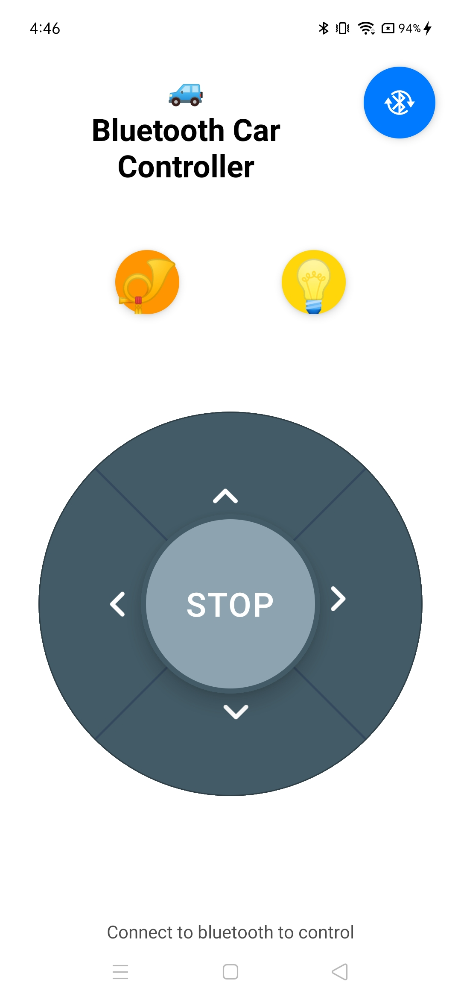

# Bluetooth Car Controller

A React Native mobile application for controlling a Bluetooth-enabled car. This app allows you to connect to your RC car via Bluetooth (Classic or BLE) and control it using an intuitive D-pad interface.

## Screenshot

## Features

- 🚗 Control your Bluetooth RC car with a responsive D-pad interface
- 📶 Support for both Classic Bluetooth and Bluetooth Low Energy (BLE)
- 🔄 Auto-discover and connect to available Bluetooth devices
- 📱 Cross-platform support (iOS and Android)
- 🎮 Intuitive directional controls (Forward, Backward, Left, Right, Stop)

## Tech Stack

- React Native with TypeScript
- React Native BLE Manager
- Context API for state management
- Custom SVG icons

## Getting Started

### Prerequisites

Before you begin, ensure you have completed the [React Native - Set Up Your Environment](https://reactnative.dev/docs/set-up-your-environment) guide.

#### Required Tools

- Node.js (v16 or higher)
- npm or Yarn
- React Native CLI
- Android Studio (for Android development)
- Xcode (for iOS development, macOS only)
- CocoaPods (for iOS dependencies)

### Installation

1. Clone the repository:
   \`\`\`sh
   git clone <repository-url>
   cd bluetoothcar
   \`\`\`

2. Install dependencies:
   \`\`\`sh
   npm install

# OR

yarn install
\`\`\`

3. For iOS, install CocoaPods dependencies:
   \`\`\`sh
   cd ios
   bundle install
   bundle exec pod install
   cd ..
   \`\`\`

### Running the App

#### Step 1: Start Metro

First, you will need to run **Metro**, the JavaScript build tool for React Native.

To start the Metro dev server, run the following command from the root of your React Native project:

\`\`\`sh

# Using npm

npm start

# OR using Yarn

yarn start
\`\`\`

#### Step 2: Build and run your app

With Metro running, open a new terminal window/pane from the root of your React Native project, and use one of the following commands to build and run your Android or iOS app:

##### Android

\`\`\`sh

# Using npm

npm run android

# OR using Yarn

yarn android
\`\`\`

##### iOS

\`\`\`sh

# Using npm

npm run ios

# OR using Yarn

yarn ios
\`\`\`

If everything is set up correctly, you should see the app running in your Android Emulator, iOS Simulator, or on your connected device.

## Permissions

This app requires the following permissions:

### Android

- \`BLUETOOTH_SCAN\`
- \`BLUETOOTH_CONNECT\`
- \`BLUETOOTH_ADVERTISE\`
- \`ACCESS_FINE_LOCATION\` (required for Bluetooth scanning on Android)

### iOS

- Bluetooth usage permissions (configured in Info.plist)

## Project Structure

\`\`\`
src/
├── App.tsx # Main app component
├── BTDevices.tsx # Device list screen
├── BTPanel.tsx # Control panel screen
├── ble/ # Bluetooth management
│ ├── bleManager.ts # BLE connection handler
│ ├── classicBTManager.ts # Classic Bluetooth handler
│ ├── bondedDevices.ts # Bonded devices management
│ └── permissions.ts # Permission handling
├── components/
│ └── DPad.tsx # D-pad control component
├── contexts/
│ └── BluetoothContext.tsx # Bluetooth state management
└── icons/ # Custom SVG icons
\`\`\`

## How to Use

1. Launch the app on your device
2. Grant necessary Bluetooth and location permissions
3. Tap the Bluetooth icon to scan for available devices
4. Select your RC car from the device list
5. Once connected, use the D-pad to control your car:
   - ⬆️ Forward
   - ⬇️ Backward
   - ⬅️ Turn Left
   - ➡️ Turn Right
   - ⏹️ Stop

## Development

To modify the app, edit the files in the \`src/\` directory. The app uses Fast Refresh, so your changes will be reflected immediately.

## Troubleshooting

If you're having issues getting the app to work:

- Ensure Bluetooth is enabled on your device
- Check that location permissions are granted (required for Bluetooth scanning on Android)
- Make sure your RC car is powered on and in pairing mode
- Try restarting the Metro bundler and rebuilding the app
- For more general React Native issues, see the [React Native Troubleshooting](https://reactnative.dev/docs/troubleshooting) page

## Contributing

Contributions are welcome! Please feel free to submit a Pull Request.

## License

This project is open source and available under the [MIT License](LICENSE).

## Learn More

To learn more about React Native, take a look at the following resources:

- [React Native Website](https://reactnative.dev) - learn more about React Native.
- [Getting Started](https://reactnative.dev/docs/environment-setup) - an **overview** of React Native and how setup your environment.
- [Learn the Basics](https://reactnative.dev/docs/getting-started) - a **guided tour** of the React Native **basics**.
- [Blog](https://reactnative.dev/blog) - read the latest official React Native **Blog** posts.
- [\`@facebook/react-native\`](https://github.com/facebook/react-native) - the Open Source; GitHub **repository** for React Native.
